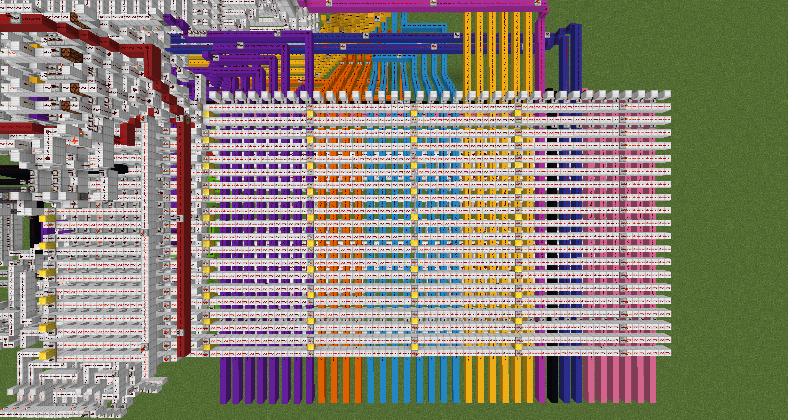
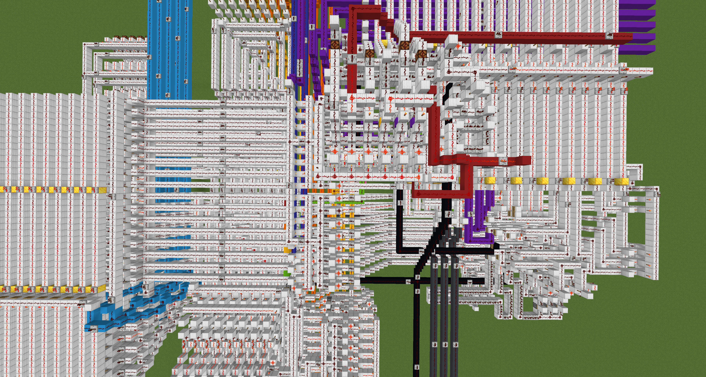
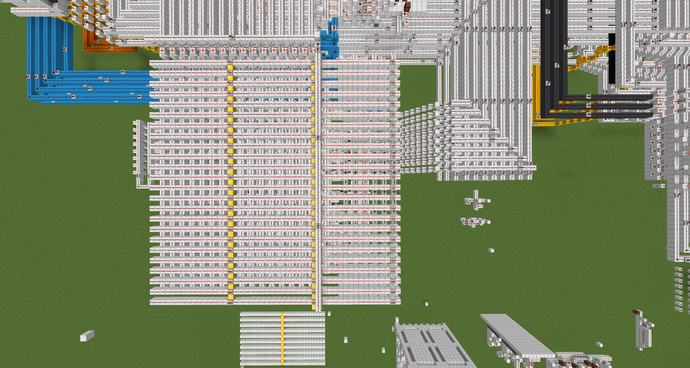
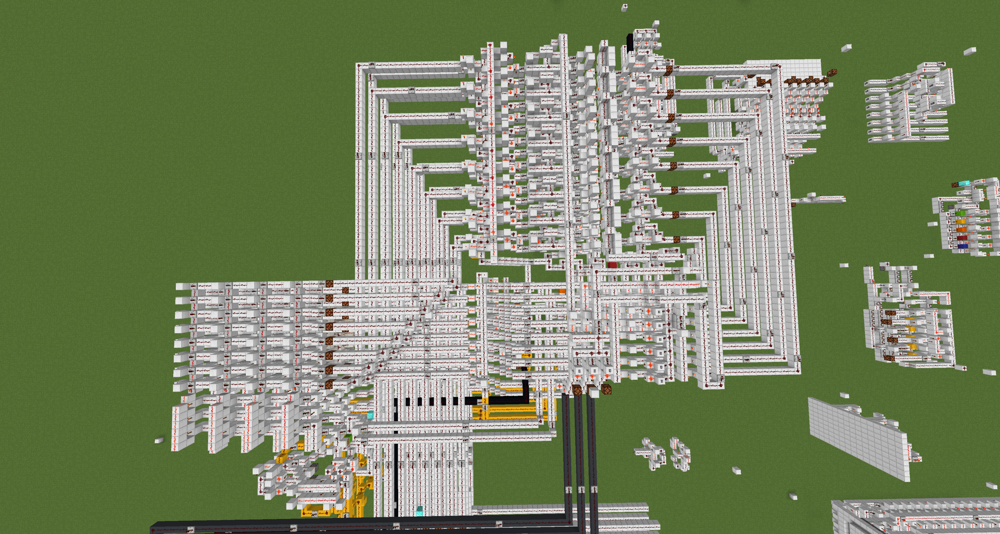
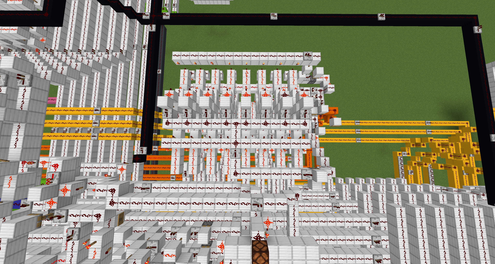
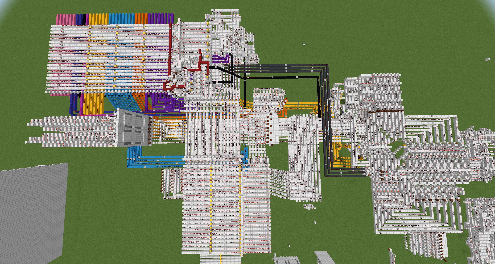

# My Approach

Roughly 5 years ago I made a processor in Minecraft (see [Some Minecraft Photos](#some-minecraft-photos)) and I had heard that something similar can be done with FPGA, so I thought I'd try to simulate a 16 bit successor to this processor. This is my first time doing FPGA/Verilog/HardCaml/OCaml so my approach may (will) look a bit strange. First I made each module of the processor in Verilog so I could work at a reasonably low level to get a feel for writing the logic in text/code. After I built all the modules I connected them with buses and control lines which are controlled by instructions from my own instruction set. After this was working in Verilog I rewrote everything in HardCaml (I'd love a t-shirt). A high level view of the architecture is shown in [Architecture](#architecture).

The architecture of the two implementations (Verilog and HardCaml) are identical and the programs work the same on each, so the Day 1 Part 1 solution from Verilog could be directly converted to the loading scheme used by HardCaml. I then solved Day 1 Part 2 by slightly adjusting the Part 1 program (in HardCaml only). The programs are written in machine code using the custom instruction set of this processor, explained in [Instruction Set](#instruction-set). See [How to Run](#how-to-run) for information on running both processors and their expected results.

I first solved the Day 1 challenges in MATLAB as I had not used it for a couple of years. I used while loops which made the programs easy to convert to machine code for my processor. I've added these for reference in `src/MATLAB solutions`. 

The programs are stored in `src/processor_hardcaml/lib/programs.ml` for HardCaml and `src/processor/program.mem` for Verilog, `src/programs` has some other Verilog programs which I used to test the functionality of the processor. The input data is stored in `src/processor_hardcaml/lib/data.ml` for HardCaml and `src/processor/data.mem` for Verilog, these are loaded into ROM from Address: 0x0400, which leaves 1024 addresses for program memory, in its current configuration, this could be adjusted if desired .

## Questions?

Make a pull request or something, or if you're from the Jane Street hardware team, then you can send me an email :)

## Pre-processing

Because the input for Day 1 is given as: 

```text
L68
L30
R48
L5
R60
L55
L1
L99
R14
L82
```

I wrote a python script to pre-process this to hex data for Verilog (using `src/python scripts/input_conversion.py`) and to the dictionary address/data pairing for HardCaml (using `src/python scripts/input_conversion_hardcaml.py`). These convert the inputs to positive (R) and negative (L) 16 bit numbers, where the negative numbers are in 2s complement so they can be loaded into the processor and used directly without any special handling. 

# Correct Solution

For my input the correct results are:
- Day 1 Part 1: 1154 


- Day 1 Part 2: 6819 


# How to Run

## HardCaml - v0.17.1

The HardCaml processor will execute Day 1 Part 1 and Day 1 Part 2 by running: `dune build bin/main.exe && dune exec bin/main.exe` in `src/processor_hardcaml`, using the programs stored in `src/processor_hardcaml/lib/programs.ml`. It will generate this output:


Which provides the expected result for Part 1 and Part 2.

## Verilog

The Verilog processor will execute the Day 1 Part 1 program by running: `iverilog -o processor_sim *.v && vvp processor_sim` in `src/processor`, using the program stored in `src/processor/program.mem`. It will generate this output: 


Which provides the expected result for Part 1.

# Instruction Set

Some specs:
- 65536 ROM addresses (executable code)
- 256 RAM addresses
- 16 Registers

## ALU

| Opcode                         | Operand                |
| ------------------------------ | ---------------------- |
| 0x\[Operation\]0\[REG:C\] <br> | 0x0\[REG:B\]0\[REG:A\] |
### Operation (Upper Byte of Opcode)

- 0x10: Addition
- 0x11: Subtraction
- 0x12: AND
- 0x13: OR
- 0x14: XOR
- 0x15: NOT
- 0x16: Shift left
- 0x17: Shift right
- 0x18: Multiplication (Assumed to be combinatorial) (Not used in any of the solutions)

### Calculations

There are 16 registers, therefore registers are determined by 4 bits

- For single input operations (NOT):
	- REG:C = \[OP\] REG:A
- For two input operations (All others):
	- REG:C = REG:A \[OP\] REG:B
		- E.g. REG:C = REG:A - REG:B
### Flags - 4 bits

The ALU has flags for: 
- Zero
- Carry
- Negative
- Overflow

\[O|N|C|Z\]

Which are set automatically using the result of the most recent ALU operations

## PC (Program Counter)

Theoretically, the jump location can be a value stored in RAM, although this is unused and untested in the processor's latest configuration.

| Opcode                 | Operand   |
| ---------------------- | --------- |
| 0xF\[CONDITION\]00<br> | 0x\[ROM\] |
### Condition (4 Bit)

- 0x0: Unconditional jump
- 0x1: Jump zero
- 0x2: Jump carry
- 0x3: Jump negative
- 0x4: Jump overflow
- 0x5: Jump not-zero
- 0x6: Jump not-carry
- 0x7: Jump not-negative
- 0x8: Jump not-overflow

## ROM -> RAM

| Opcode               | Operand       |
| -------------------- | ------------- |
| 0x31\[RAM:DEST\]<br> | 0x\[ROM:SRC\] |
- RAM: 8 bit
- ROM: 16 bit

## RAM -> REG

| Opcode                | Operand         |
| --------------------- | --------------- |
| 0x920\[REG:DEST\]<br> | 0x00\[RAM:SRC\] |
- REG: 4 bit
- RAM: 8 bit

## REG -> RAM

| Opcode               | Operand          |
| -------------------- | ---------------- |
| 0x910\[REG:SRC\]<br> | 0x00\[RAM:DEST\] |
- REG: 4 bit
- RAM: 8 bit

## ROM(\[RAM:SRC\]) -> \[RAM:DEST\]

Loads a value from ROM, where the address is the value stored in RAM, the result is then stored in another RAM location.

| Opcode              | Operand          |
| ------------------- | ---------------- |
| 0x32\[RAM:SRC\]<br> | 0x00\[RAM:DEST\] |
ROM(\[RAM:SRC\]) -> \[RAM:DEST\]

This can be used to iterate through a list of data in ROM by iterating the value in \[RAM:SRC\]. Its like iterating a pointer to a value in an array to move through the elements of the array.

## Outputs

### Output from Register

| Opcode       | Operand |
| ------------ | ------- |
| 0x220\[REG\] | 0x0000  |
### Output from RAM

| Opcode | Operand     |
| ------ | ----------- |
| 0x4200 | 0x00\[RAM\] |
These output the data from the REG/RAM onto the data bus and display this to the user in the terminal.

## MISC

### Halt 
| Opcode | Operand |
| ------ | ------- |
| 0x0000 | 0x0000  |
### No-op (HardCaml)

| Opcode | Operand |
| ------ | ------- |
| 0x0F00 | 0x0000  |

### No-op (Verilog)

| Opcode | Operand |
| ------ | ------- |
| 0xFFFF | 0xFFFF  |

# Architecture

I've scribbled together a high-level view of the architecture of the simulated processor.

[](attachments/FPGA_Architecture.pdf)

# Some Minecraft Photos

Here are some photos of my Minecraft processor, whose architecture was used as a basis for this simulated processor. The Minecraft processor is 8 bit (16 bit instructions), whereas the simulated processor is 16 bit (32 bit instructions), and the instruction set is different because I couldn't remember how the Minecraft one worked. 


Instruction decode to drive control lines.


State machine to control fetch-decode-execute operations.


ROM (24 addresses, can be expanded to a massive 32 addresses) (RAM and a Stack is hidden below the ROM).


The ALU (with 4 dual read registers in the bottom left).


Program counter.


The entire processor.

# Licensing

This repo was developed for Jane Street's 2025 Advent of FPGA challenge. This repo is open source under the MIT License and free to use for any purpose (but why would you want to?). It solves the 2025 Advent of Code Day 1 Part 1 and Day 1 Part 2.